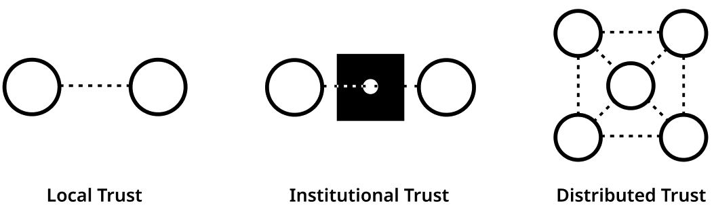
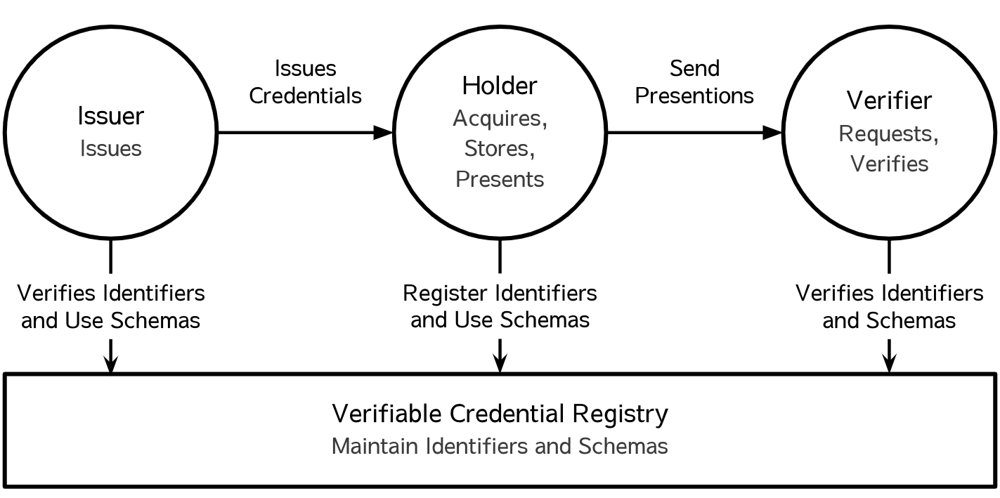
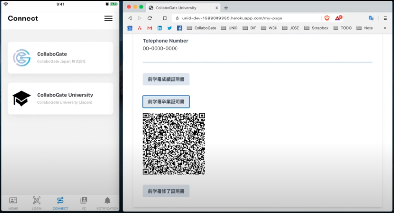
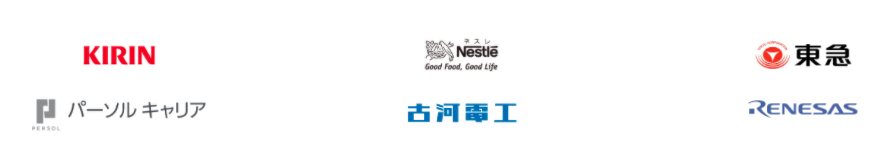

<SEO title="UNiD" />

### Digital Trust

Until now, our society has been established by reducing that complexity through trust.
According [Rachel Botsman](https://www.ted.com/speakers/rachel_botsman), trust has been through three significant chapters in human history:
> We’ve moved from **local trust**, where it was based on one-to-one interactions and personal reputation.
> Next came **institutional trust**: when we went through mass urbanization and wanted to trade internationally, this local trust wasn’t scalable. So we invented institutions and institutional mechanisms.
> But over the years the flow of trust between people has dwindled while institutions have become bureaucratic, centralized and opaque.
> Technology is now taking that institutional power and distributing it, bringing us in to the third phase she called **distributed trust**.

> 

In many parts of the world, the rapid acceleration of digital transformation by COVID-19 has brought to light various initiatives and issues related to **digital trust**.
For example, we can see many cases where administrative services become rather cumbersome due to the complexity of digital verification process.
These issues are caused by the fact that current Internet do not have sufficient functionality as to whether the data transferred is reliable in human social activity.

At [UNiD Platform](./unid), we are focused on building tools that enable **digital trust** on common standards for privacy and security in order to take the next phase of trust.
As a first step, it's important to establish a globally unique identity that can be controlled directly by a user without the need for centralized authorities or trusted third parties.

### Decentralized Identity

Decentralized identity, also know as self-sovereign identity (SSI), is a digital movement that evolves digital identity on the Internet based on open web standards at organizations such as the [W3C](https://www.w3.org/), [Decentralized Identity Foundation](https://identity.foundation/), [IETF](https://ietf.org/), and [the Hyperledger Project at the Linux Foundation](https://www.hyperledger.org/). A central part of the movement is the emerging standardization around Decentralized Identifiers (DIDs) which is a new type of identifier to allow individuals to create and control their own unique identifiers.

In contrast to typical, federated identifiers, DIDs have been designed so that they may be decoupled from centralized registries, identity providers, and certificate authorities.
Any subject (e.g., a person, organization, thing, data model, abstract entity, etc.) can use these identifiers to obtain verifiable credential (VC) from trusted organizations and present these credentials as proof of claims about themselves.

> The roles of the core actors and the relationships between them in an ecosystem where DIDs and verifiable credentials are expected to be useful.

> 

[UNiD Platform](./unid) provides fundermental capabilities of operating DIDs, verifiable credentials, encrypted data storage, communications bwtween DIDs in a privacy-preserving manner.

### Use Cases

**Intro digital student wallet as a use case**

In the simplest use case, this is a demonstration of passwordless login and credential issuance
when students apply for transcripts to their university to understand the roles in DID ecosystem and how to establish **digital trust**.

1. A student goes to an university website and read a QR code for login through his digital student wallet.
He can easily login and access the website with his DID without any password in a secure manner.
The benefits for a service provider (in this case, it may be a vendor or university) can eliminate the need to hold personal information in "HoneyPot" for bad actors, which has become a liability in a recent years.

> 

2. A student goes to apply transcript page and read a QR code again. The web application issues a transcript with university digital signature and send the credential to a student. Students can bring a verifiable credential that can be used to prove his educational history to other entities quickly.

> 

This sort of credentials can be presented to apply a job to enterprises. The enterprise as a verifier can cryptographically prove that the credential is correct without contacting the issuer. That begins establishing **digital trust** around that DIDs by using it in their digital interactions. Through the [UNiD Extensions and SDKs](./unid/3-extensions), our platform offers convenient and easy-to-access application logic to build solutions and integrate with digital services that exist out of our platform.

**wide variety of use cases**

Our platform is composed of a collection of microservices, allowing developers to combine pluggable and exntensible modular for flexibility and freedom of choice without compromising security for a wide variety of applications for:

- Online Bank
- Insurance
- Human Resource
- Eduation
- Healthcare
- Gig Economy
- B2B transaction
- SmartCity
- Energy
- Travel
- Government

Currently, we are working on establishing **digital trust** with leading companies in each industry:

