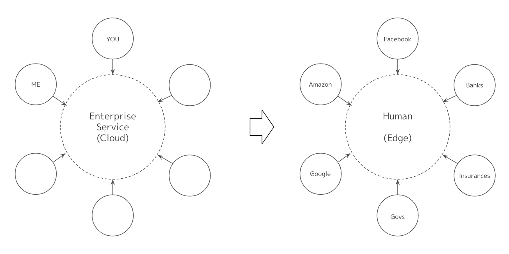

### Intro
We are focused on building trusted data exchange platform atop the Internet. The rapid acceleration of digital transformation by COVID-19 has brought to light many digital trust issues. It can be seen that these issues are occuring when implementing the 'trust' structure that traditional social systems have been responsible for on the Internet. In order to scale the 'trust' to the global demand of digital systems and the internet, it is necessary to establish ***trusted web*** as the social infrastructure on common standards for privacy, security, and transparency. It is extremely important step to establish a global usable [digital identity](./2-digital-identity) as central part of ***trusted web***.

Decentralized identity, also know as self-sovreign identity (SSI), is a digital movement that evolve digital identity on the Internet based on open web standards at organizations such as the [W3C](https://www.w3.org/), [Decentralized Identity Foundation](https://identity.foundation/), [IETF](https://ietf.org/), and [the Hyperledger Project at the Linux Foundation](https://www.hyperledger.org/). A central part of this movement is the emerging standardization around Decentralized Identifiers (DIDs). DIDs are cryptographically secure identifiers that are controlled directly by a user without the need for centralized authorities or trusted third parties. They allow anybody to prove they have ownership of an ID on a device they own, login to apps and services with their ID, and begin establishing trust around that ID by using it in their digital interactions.

### Human Centric Data Circulation

DIDsをはじめとする技術革新により、これまでサービスを中心に設計されていたデータ循環の流れから、個人を中心に設計されたデータ循環の流れに変わっていきます。これまでサービスごとにサイロ化していたデータが、個人を中心に循環することで、さまざまな企業間の共創を生み出すことができます。私たちは安心・安全を確保しつつ、生活インフラに関わるような、さまざまなサービスと信頼できる方法でコミュニケーションすることができます。

