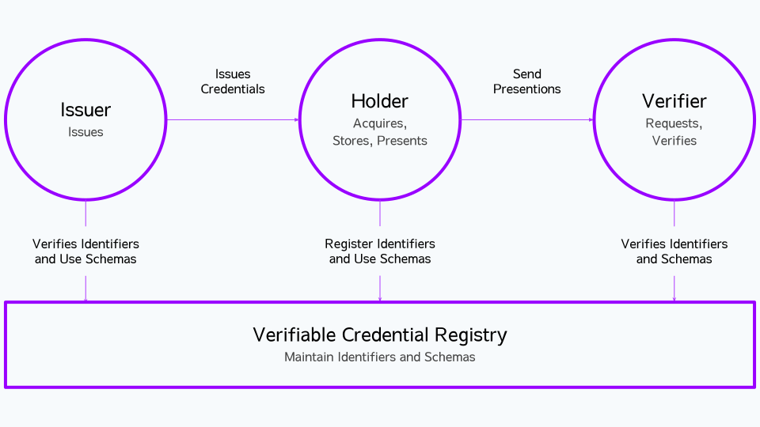

# What is Decentralized Identity

## Digital Identity

Decentralized identifiers(DIDs) is a new type of identifier to allow individuals to create and control their own unique identifiers.
In contrast to typical, federated identifiers, DIDs have been designed so that they may be decoupled from centralized registries, identity providers, and certificate authorities.

Any subject(e.g., a person, organization, thing, data model, abstract entity, etc.) can use these identifiers to obtain Verifiable Credential (VC) from trusted organizations and present these credentials as proof of claims about themselves.

In the simplest case, service providers can authenticate with users without the need for a usename or password. The benefits for users is that they no longer have to manage passwords, they can securely and easy to access services. Service providers can eliminate the need to hold personal information in "honeypot" for bad actors, which has become a liability in a recent years.

## DID Ecosystem overview
The picture describes the roles of the core actors and the relationships between them in an ecosystem where DIDs and verifiable credentials are expected to be useful. 

Let's check the roles with a digital student wallet as an example: Education organization(e.g., a school, university, colleage, online course, etc.) will issue some education credentials to students (holder). 