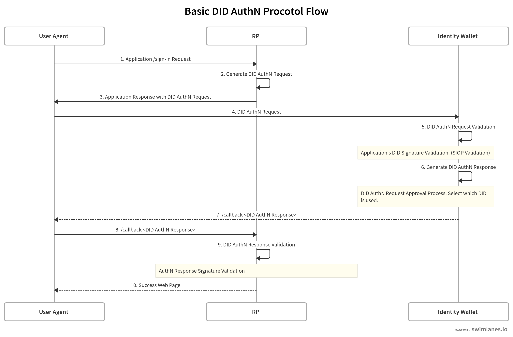

### 概念的な説明

できるようになること：身体的なF2Fでの認証に近いことができるようになる。これまでの認証とは異なり、プライバシーとセキュリティを担保しつつ、シームレスな認証を実現できる。

- ClientとApplicationが、安全に通信するための認証について
- DIDsとインタラクションするRPは、DID-Authプロトコルの上で通信するためのSDKs and/or APIsが必要になります。



基本的にはこの類型。

### Generate DID AuthN Request

**DID.generateAuthenticationRequest()**

```js
import * as Unid from "@unid/node-unid-rp-sdk";
function DID.generateAuthenticationRequest(self, request_params){
    return 'success';
};
```
request_paramはIdentity Walletに返して欲しいParams
Credential Typeで要求する？@千葉さん

### DID AuthN Response Validation

**DID.validateAuthenticationResponse()**

```js
import * as Unid from "@unid/node-unid-rp-sdk";
function DID.validateAuthenticationResponse(UserDid){
    return 'validated';
};
```

SIOPでは
The RP MUST validate the `SIOP Response` as described in the Self-Issued ID Token Validation section in OIDC.Core. This includes:

Optionally decrypting the JWE to obtain the JWS which contains the id_token.
Verifying that the id_token was signed by the key specified in the sub_jwk claim.
Additionally, the RP MUST validate the id_token against the SIOP's DID Document as follows:

Resolve the DID Document from the SIOP's DID specified in the did claim.
Determine the verification method from the SIOP's DID Document that matches the kid of the sub_jwk claim in the id_token.
Verify the id_token according to the verification method above. This step depends on the verification method in the authentication section in the DID Document and is out-of-scope of this specification.
