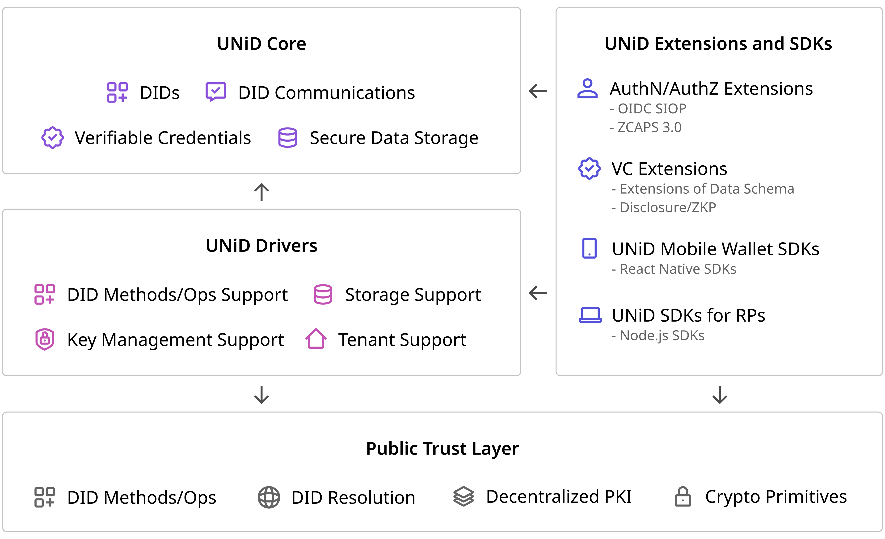

### Intro

The UNiD Platform provides a means for trusted data exchange in a scalable manner. The UNiD implementation is composed of a collection of microservices, allowing developers to combine pluggable and exntensible modular for flexibility and freedom of choice without compromising security.

As the below figure, our platform consists of three components: UNiD Core, Drivers, Extensions, and SDKs.

### UNiD Core

The UNiD Core has fundermental capabilities of decentralized identifiers and verifiable credentials technologies.

- DIDs
- Verifiable Credentials
- DID Communications
- Secure Data Storage

See [more detials](/unid/1-core)

### UNiD Drivers

The UNiD Drivers are pre-configured integrations to our platform that support DID methods, operations, key management systems and encrypted data storage. that run atop of public trust layer. The drivers are pluggable for preventing vendor lock-in and enabling users choices.

- DID Methods/Operations Support
- Key Management Support
- Storage Support
- Tenant Support

See [more details](/unid/2-drivers)

### UNiD Extensions and SDKs

The UNiD Extensions and SDKs offer convenient and easy-to-access application logic to build solutions and integrate with digital services that exist out of our platform. The required authentication/authorization and credential data model are strongly dependent on use cases which are outside scope of UNiD Core and Drivers.

- DID authentication/authorization
	- OIDC SIOP
	- ZCAPS3.0
- Credential Extensions
	- Data Schema
	- Disclosure/ZKP
- UNiD Mobile Wallet SDKs
- UNiD SDKs for Relying Parties

See [more detials](/unid/3-extensions)

### Public Trust Layer

- DID Methods/Ops
- DID Resolution
- Decentralized Public Key Infrastruture (DPKI)
- Crypto Primitives

### Developer Tools

- UNiD Command Line Interface (CLI)
- UNiD Monitoring Tools

See [more details](/unid/4-developer-tools)

