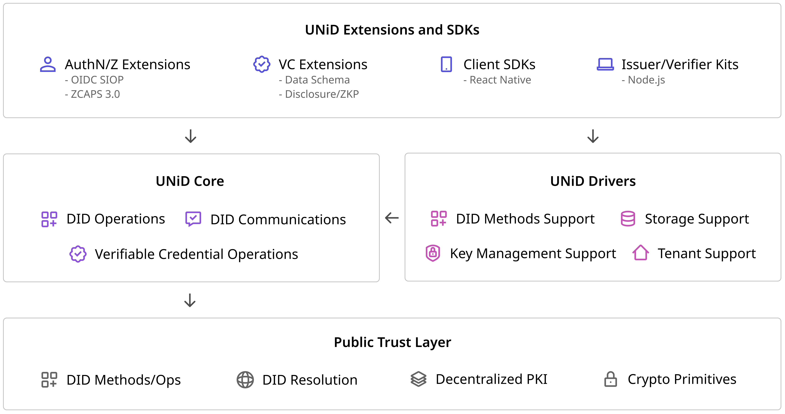

### Intro to UNiD Platform

The UNiD Platform provides developers with a means to build **digital trust** in a scalable manner. UNiD implementation is composed of a collection of microservices, allowing developers to combine pluggable and extensible modular for flexibility and freedom of choice without compromising security.

As in the diagram below, our platform consists of three components: **UNiD Extensions and SDKs**, **UNiD Core**, and **UNiD Drivers** on the top of Public Trust Layer.

The Public Trust Layer is actively developed and implemented based on open source codes and open web standards at organizations. **UNiD Drivers** pre-configured integrations to our platform that support decentralized identity capabilities. **UNiD Core** are designed as a set of APIs used through **UNiD Extensions and SDKs** to easily incorporate these capabilities into your application.

### UNiD Core

UNiD Core are designed as a set of APIs for supporting DID Operations, Verifiable Credential Operations, and DID Communications.

- DID Operations
- DID Communications
- Verifiable Credential Operations

See [more detials](/unid/1-core)

### UNiD Drivers

The UNiD Drivers are pre-configured integrations to our platform that support DID methods, key management, secure storage, and tenant model. The drivers are pluggable for preventing vendor lock-in and enabling users choices without compromising security.

- DID Methods Support
- Key Management Support
- Storage Support
- Tenant Support

See [more details](/unid/2-drivers)

### UNiD Extensions and SDKs

The UNiD Extensions and SDKs offer convenient and easy-to-access application logic to build solutions and integrate with digital services that exist out of our platform. The required authentication/authorization and credential data model are strongly dependent on use cases which are outside scope of UNiD Core and Drivers.

- DID Authentication/Authorization
    - OIDC SIOP
    - ZCAPS3.0
- Verifiable Credential Extensions
    - Extensible Data Schema
    - Selective Disclosure
- UNiD Client SDKs
    - React Native
- UNiD Issuer/Verifier Kits
    - Node.js

See [more detials](/unid/3-extensions)

### Developer Tools

- UNiD Command Line Interface (CLI)

See [more details](/unid/4-developer-tools)
