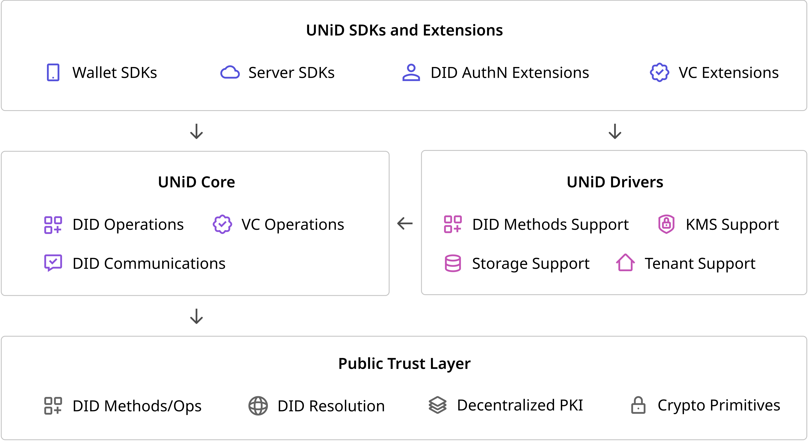

### Intro to UNiD Platform

The UNiD Platform provides developers with a means to build **digital trust** in a scalable manner. UNiD implementation is composed of a collection of microservices, allowing developers to combine pluggable and extensible modular for flexibility and freedom of choice without compromising security.

As in the diagram below, our platform consists of three components: **UNiD SDKs**, **UNiD Core**, and **UNiD Drivers** on the top of Public Trust Layer.

The Public Trust Layer is actively developed and implemented based on open source codes and open web standards at organizations. **UNiD Drivers** pre-configured integrations to our platform that support decentralized identity capabilities. **UNiD Core** are designed as a set of APIs used through **UNiD SDKs** to easily incorporate these capabilities into your application.

### UNiD Core

UNiD Core consists of a set of modules and APIs that support core functions such as DID operations, VC operations, and DID communications. UNiD SDKs and extension tools are built on the top of it. [Click here for more info](/unid/1-core)

### UNiD Drivers

The UNiD Drivers are pre-configured integrations to our platform that support DID methods, key management, secure data storage, and tenant model. The drivers are pluggable for preventing vendor lock-in and enabling users choices without compromising security. [Click here for more info](/unid/2-drivers)

### UNiD SDKs

The UNiD SDKs offer convenient and easy-to-access application logic to build solutions and integrate with digital services that exist out of our platform. UNiD extension tools support the features such as DID AuthN and VC Data Schema that are strongly dependent on each use case and are outside scope of UNiD Core and Drivers. [Click here for more info](/unid/3-extensions)
