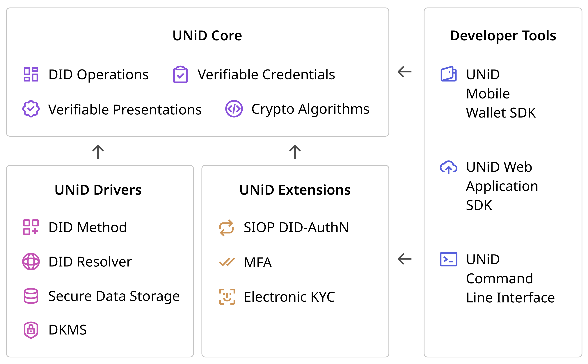

## Introduction

UNiD aims to deliver the trusted data exchange platform in a scalable manner. It consists of four blocks and follow the principle; industry-standard crypto algorithm, extensible data schema, secure authenticate protocols, and semantic data model. Each components is designed to keep loose coupling so that it let developers build a flexible application by combining DID capabilities with UNiD Drivers and Extensions.

### [UNiD Core](/unid/1-core)

- DID Operations
- Verifiable Credentials: Semantic Data Model, JSON-LD, LD-proof
- Verifiable Presentations: Selective Disclosure
- Cryptographic Algorithms

### [UNiD Drivers](/unid/2-drivers)

- DID Method Support
- DID Resolver: universal-unid-resolver
- Secure Data Storage (SDS):
- Decentralized Key Management System (DKMS): Mnemonic, Shamir Secret Sharing

### [UNiD Extensions](/unid/3-extensions)

- SIOP DID-Authentication
- Multi Factor Authentication
- Electronic KYC
- Others

### [Developer Tools](/unid/4-developer-tools)

- Mobile Wallet SDK: React Native SDK
- Web Application SDK: Node.js SDK
- UNiD Command Line Interface (CLI)
