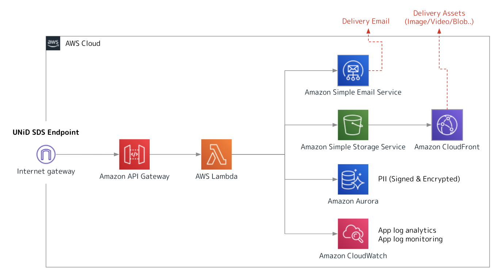

### DID Method Support

DID methods provide the means to implement this specification on different verifiable data registries.
New DID methods are defined in their own specifications, so that interoperability between different implementations of the same DID method is ensured.
This section specifies the requirements on any DID method, which are met by the DID method's associated specification.

**Currently Supported DID Methods**
- `did:unid`
- `did:ion`
- `did:{custom_method}`

### SDS Support

UNiD Drivers support SDS (Secure Data Storage) to be pre-configured for each tenant. Every requests to SDS endpoints will be verified by signature and tenant token. Since all data stored in UNiD SDS is encrypted, all systems including UNiD Drivers can not know the contents of data.

<!--

-->

### Key Management Support

Currently, we generate a master seed from 24 mnemonic phrases, and based on this, we generate multiple key pairs required for DID Operations. Currently, we are developing a decentralized key management solution that can respond to the demands of each application by incorporating cryptographic technologies such as secret sharing.

### Tenant Support

UNiD Platform provides a tenant system for each organization that build a digital trust platform. In your tenant, you can register multi applications and relying parties to expand a digital trust network. Please head over [here](https://tenant.getunid.io) to setup an account.
