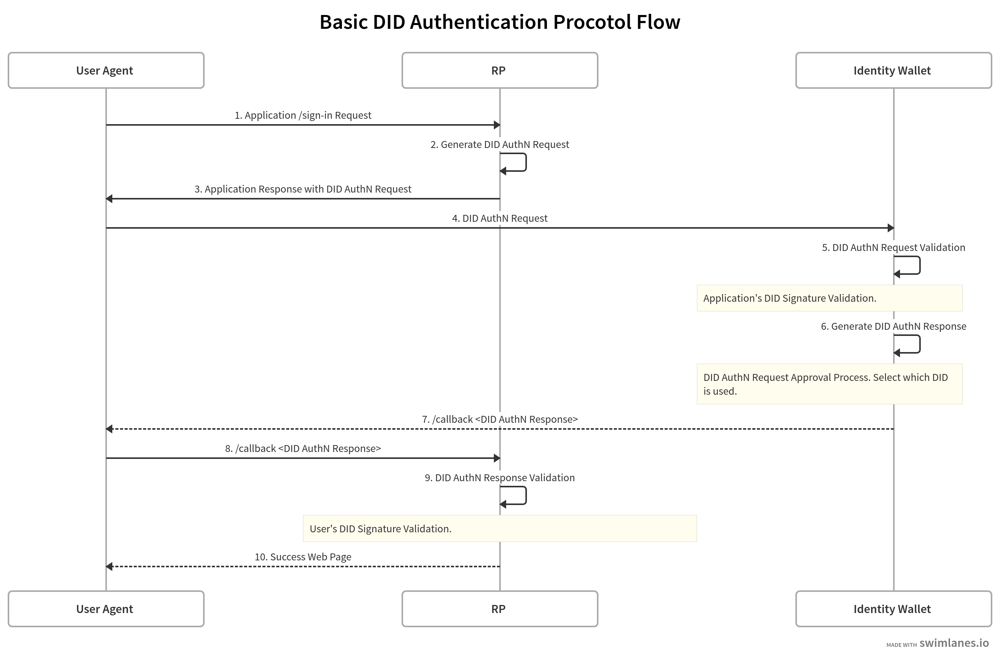

### DID AuthN

For the wallet to communicate with relying parties (RP) on secure authenticated channel, UNiD wallet SDKs provide methods of:

- validating DID AuthN request from a RP
- generating DID AuthN response to a RP

The below diagram illustrate the sign-in flow and steps taken to verify a user through their user agent from the wallet side of the webpage to the server side of a RP. If you want to see more details of DID AuthN, please head over [here](../unid/3-extensions).



### Validate AuthN Request

In step 5 of the diagram, the wallet receives an authN request from the RP. The wallet queries for the RP's DID document using a Universal Resolver and verifies the signature with the RP's public key.

**UNiD.validateAuthenticationRequest()**
```js
import { UNiD } from "@unid/react-native-unid-wallet-sdk";

(async () => {
    try {
        // DID AuthN Request with applicationDid
        const result = await UNiD.validateAuthenticationRequest(applicationDid);
        console.log("Complete validating DID AuthN Request", result);
    } catch err(err){
        console.err(err);
    };
})()
```

### Generate DID AuthN Response

In step 6 of the diagram, the wallet creates a DID AuthN response signed by the selected DID. The response object can envelop a verifiable presentation and will be put into a JWS signed by the DID.

**DID.generateAuthenticationResponse()**
```js
import { UNiD } from "@unid/react-native-unid-wallet-sdk";

(async () => {
    try {
        const DID = await UNiD.loadDid({
			did: "did:unid:test:EiCsnBO7XrB9hL96xvQ2R846j_Ebuyg3HO5o4BOSoU7ffg"
		});
        const result = await DID.generateAuthenticationResponse({
            requestedPresentation: presentation
        });
        console.log("Complete generating DID AuthN Response", result);
    } catch err(err){
        console.err(err);
    };
})()
```

<!--
### Tutorial DID AuthN

デモ用のDID authN request of RPをQRコードで設置
テストできるようにする
-->
