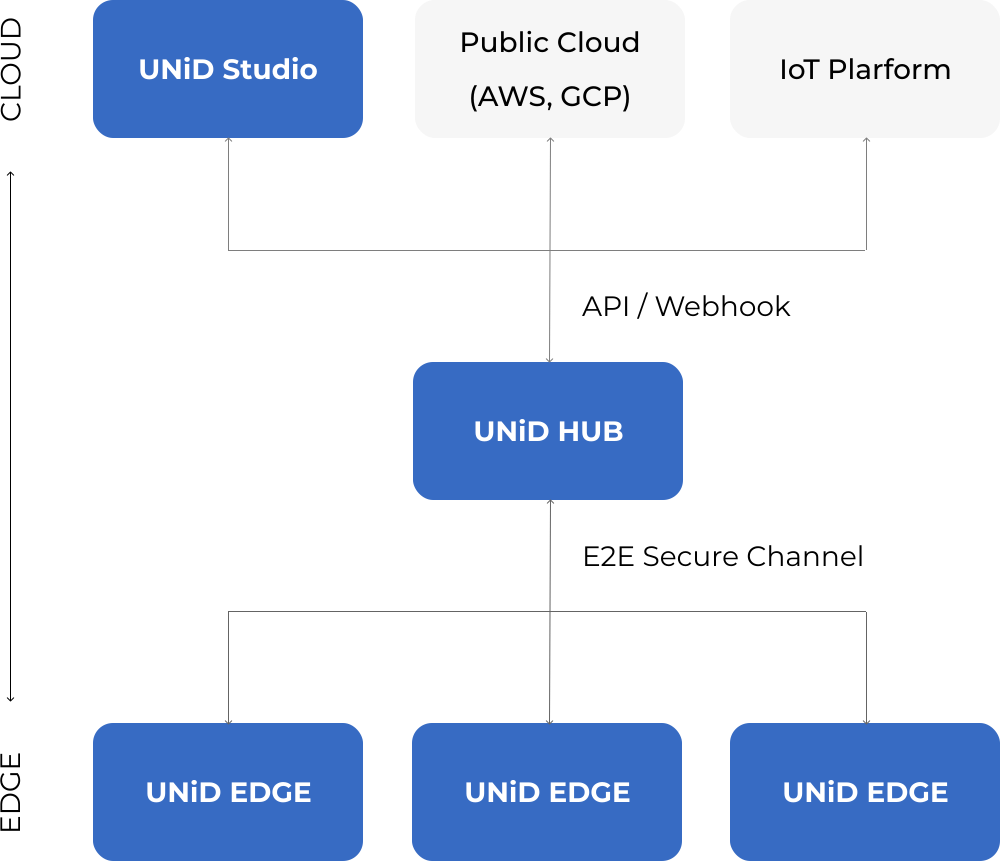
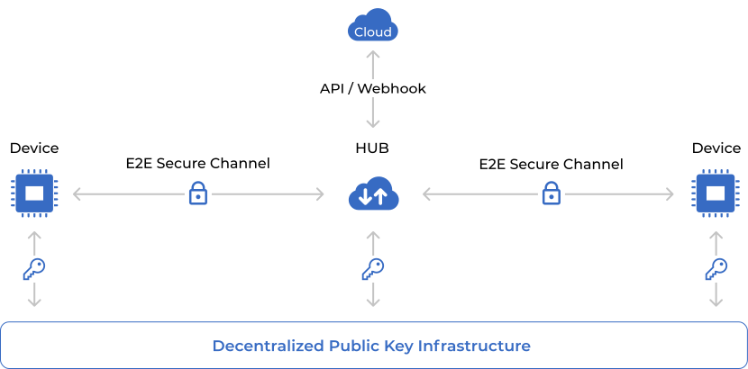
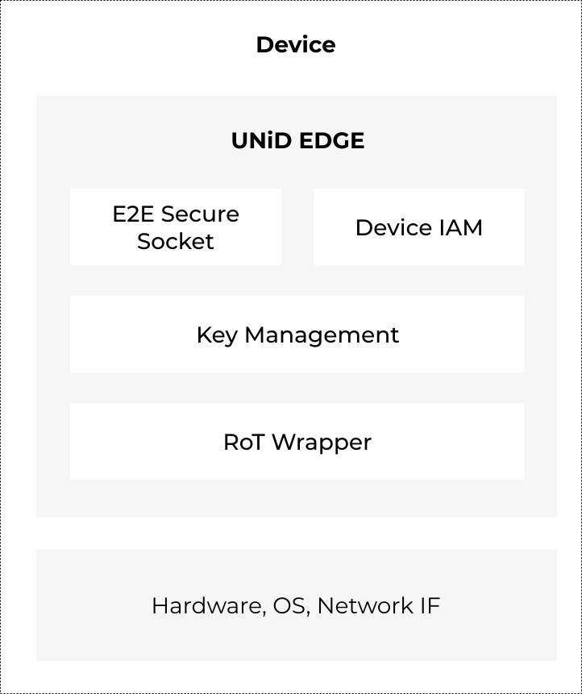
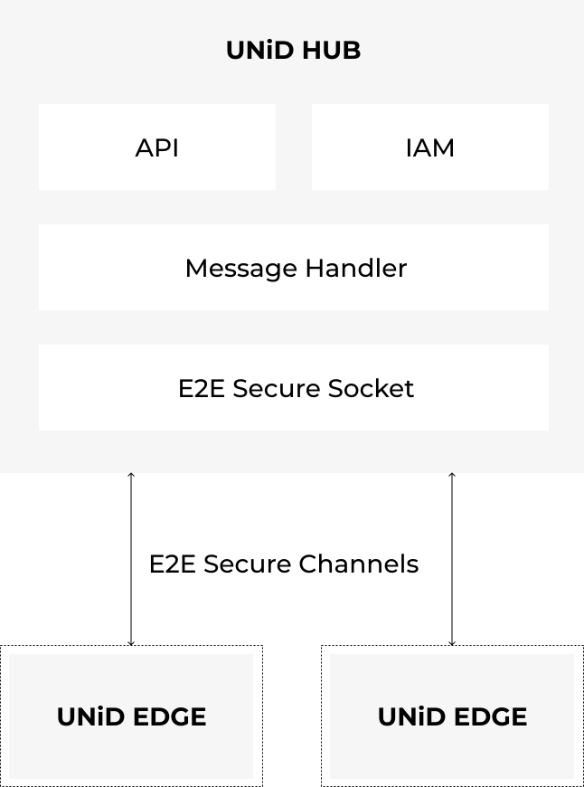
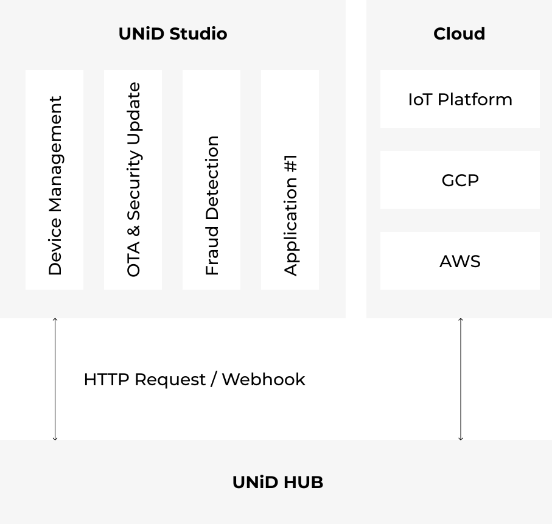
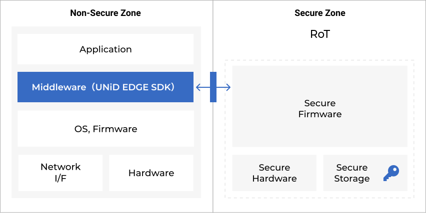

# Overview
This section describes the overview of UNiD platform, architecture of each block, and introduces the core features of the UNiD platform.

## UNiD platform

As shown in Figure.1, UNiD platform consists of the UNiD EDGE, which is an open-source embedded middleware in devices, UNiD HUB, which is a message handler, and UNiD Studio, which is a device management system.
UNiD EDGE is provided as an [open-source SDK](https://github.com/getunid/unid), while UNiD HUB and Studio are hosted and provided in a cloud environment.
By embedding UNiD EDGE in devices, developers can establish E2E authentication channels with UNiD HUB, and realize secure bi-directional communication between devices and the cloud through HUB's API.

UNiD proposes a new approach that abstracts every device and the cloud as a globally unique endpoint, and an endpoint can securely and privately interact with each other regardless of the network topology or routing hops (as shown in Figure.2). This identity-first approach can provide more flexible and scalable end-to-end data security without the traditional complex network configurations and best efforts in the field.

## Architecture

### UNiD EDGE

UNiD EDGE is an embedded middleware. As shown in Figure.3, UNiD EDGE consists of 4 major components: RoT Wrapper, Key Management, IAM, and E2E Secure Socket.
- RoT Wrapper has extensions for various TEEs, TPMs, HSMs, and Secure Enclave.
- Device keys, security parameters, and cryptographic processing are all performed in the RoT secure storage and execution area.
- Device IAM manages device ID and credential, registers public keys with the decentralized PKI, and performs device authentication and authorization.
- E2E Secure Socket establishes an end-to-end authenticated channel with UNiD HUB for secure bi-directional communication regardless of the network topology or routing hops.

### UNiD HUB

UNiD HUB is a message handler between devices and the cloud. As shown in figure.4, UNiD HUB consists of 4 major components: E2E Secure Socket, IAM, Message Handling, and API that can be referenced by cloud services.
- E2E Secure Socket establishes end-to-end authenticated channels with the devices embedded with UNiD EDGE.
- Message Handler processes and brokes data between devices and the cloud.
- IAM authenticates and authorizes users including cloud applications through API.
- APIs and webhooks that allow developers to easily connect to existing cloud services and IoT platforms.

### UNiD Studio

UNiD Studio is an application based on UNiD HUB’s API for device management (as shown in Figure.6).  
As shown in Figure.5, UNiD Studio provides common features needed to manage devices: visualize device status, update firmware and security parameters, and detect unauthorized access and connections.  
Developers can build their own management tools or connect existing IoT platforms through UNiD HUB's APIs.

## Core features

### Easy to Use
In order to utilize IoT data or update firmware from the cloud securely, a system to identify, authenticate, and authorize devices is required. To identify the devices from the cloud, developers need to build a key management system on devices that cannot be tampered with. RoT can be used to achieve this goal, however it requires a high level of expertise and a lot of effort to understand the functionality and learn how to use the low level API of RoT.
Furthermore, manual operations for key injection at the manufacturing stage and the cloud system for key management throughout the entire product lifecycle are required. Thus, even if we look at just the key management, there are so many things that need to be considered from the development stage.
As shown in Figure.7, UNiD EDGE SDK is wrapping RoT low level APIs, making it easy for developers to build key management systems. Thus, UNiD abstracts the complexity of the security stack by providing simple and easy-to-use SDKs, allowing developers to focus on developing applications.

### Automate Device Provisioning

By leveraging decentralized identity technology, UNiD allows devices to autonomously generate key pairs, provisioning, and establish end-to-end secure channels with pre-configured remote servers.
In the typical provisioning flow, the provisioner manually generates and injects private keys into the devices, and registers the corresponding public keys and device ID with the intermediate PKI and device management system. This manual operation comes at a high cost, plus you need to invest in a physical security environment and employee background checks to reduce the vulnerability in the manufacturing line. Typically, key injection costs between $0.5 and $2.0 USD per device. When you are going to build your own private PKI, you also need to manage the private keys of intermediate CAs with HSMs, which can be costly.
UNiD allows devices to autonomously generate key pairs with RoT, computes the hash from the key pairs to create the payload, and registers the payload with the DPKI network based on blockchain. In the flow, you don't need to trust any intermediaries such as the provisioners and intermediate CAs. UNiD can fully automate the provisioning process to eliminate the manual operation costs and vulnerabilities in your manufacturing line (as shown in Figure.8).

### Security Lifecycle Management

UNiD defines the security lifecycle that is shown in Figure.9 as intended to capture the minimum set of lifecycle status and transitions in compliance with a PSA (platform security architecture) framework.
The security lifecycle status is always stored in RoT secure storage as the device instance information. In development mode, UNiD EDGE SDK sets the security lifecycle status as “test”. In production mode, the status starts with “provisioning” and changes to “secured” when an end-to-end secure channel with UNiD HUB is established. UNiD platform allows only authorized users to change the status from “secured” to “PRoT debug” and “decommissioned”. When the status is changed to “decommissioned”, UNiD EDGE SDK revokes the DID Document and removes the sensitive information such as device key pairs and instance information.
Based on the framework, UNiD provides features such as device management, fraud detection, security updates, and over-the-air to realize more scalable and efficient device maintenance and operation, which have been done manually in the past.
