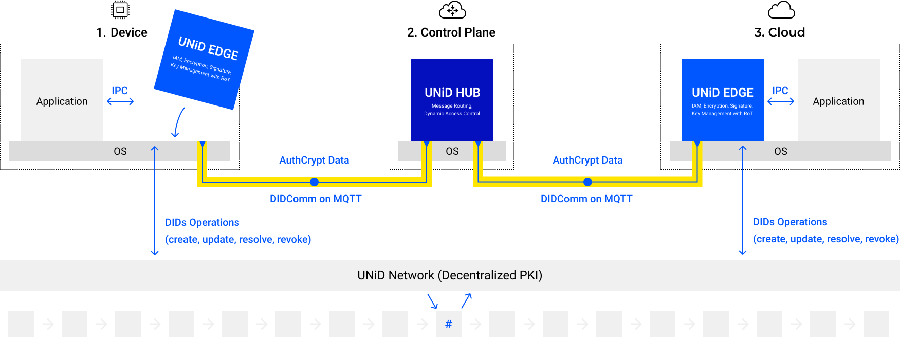
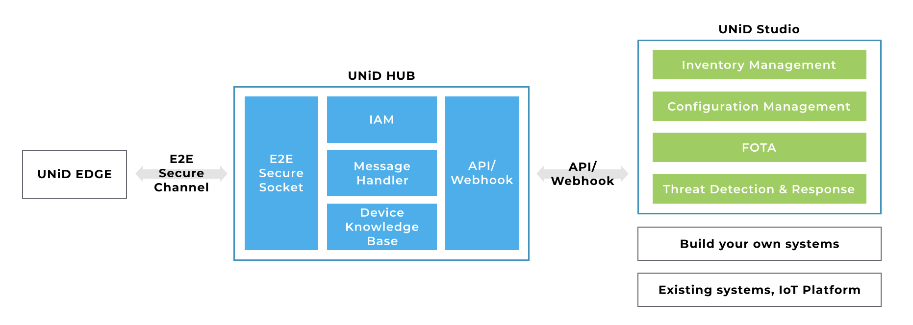

# NodeX

## Overview

NodeX is an end-to-end security platform which consists of the following blocks;

- **NodeX EDGE (hereinafter called "EDGE")** is an open source library that integrates into endpoint devices
- **NodeX HUB (hereinafter called "HUB")** is a control plane for message routing and dynamic access control of EDGEs.
- **NodeX Network** is a distributed network that operates public key certificates (DID Documents) of EDGEs.

Simply launch a HUB for each project, integrate EDGE into IoT devices and cloud servers, and connect the EDGEs to the HUB to initiate secure end-to-end communication between EDGEs while ensuring device authenticity, data integrity, and privacy. 

:::{figure-md}

**Figure 1.** NodeX Overview
:::

## Design Concept

Our main concept is to build a scalable, end-to-end security infrastructure that abstracts every device and the cloud as a global unique node, allowing a node to interact with other nodes securely and privately regardless of the network topology or routing hops.

:::{figure-md}

**Figure 2.** E2E security infrastructure
:::

To achieve this concept, we utilize decentralized identifiers (DIDs) and Root of Trust (RoT) technologies. Specifically, NodeX EDGE generates multiple key pairs from a hardware-derived true random number generator (TRNG) within the RoT secure processing environment, and generates a payload for registering with a blockchain-based decentralized PKI (DPKI) to create a DID document including the public key information. Anyone can obtain the corresponding device's public key from the network to authenticate the device and verify the digitally signed data. To learn more, click here.

This identity-first, end-to-end approach can abstract the complexity of security infrastructure and enables advanced, scalable endpoint security for connected systems. NodeX platform is designed to make the security infrastructure easily available and free all developers from the heavy burden of building the complex security infrastructure for each product.

## Architecture

### NodeX EDGE

NodeX EDGE is an open source Rust library to integrate into embedded Linux OS and RTOS. It consists of the following components;

- **Device identifier**: This component supports generating global unique device's identifiers compliant with a W3C standard (Decentralized Identifiers (DIDs) v1.0).
- **Device key management**: This component supports generating key pairs within the device and operating such as public key certificate (DID Document) generation, resolve, renewal, and revocation.
- **RoT extension**: This component can be applied to RoTs with proprietary specifications by implementing shared libraries according to the API specification.
- **Device authentication**: This component supports device authentication based on digital signature scheme (256-bit ECDSA) rather than username and password.
- **Policy management**: This component allows security-relevant configuration changes through an authorized NodeX HUB. It has access policy file (IPs, DIDs, endpoints), security policy file (security parameter, pre-shared-key) and update policy (logging transmission frequency).
- **E2E secure socket**: This component supports establishing authenticated channels with the HUB.
- **Distribution**: It can be distributed as middleware for IPC communication with client applications, also can be distributed as a library integrated into client applications.

:::{figure-md}

**Figure 3.** NodeX EDGE Architecture
:::

Currently supported OS;
- Linux Kernel x86 (32 bit)
- Linux Kernel x86-64 (64 bit)
- FreeRTOS

### NodeX HUB

NodeX HUB is a control plane for message routing between EDGEs and dynamic access control of devices. It consists of the following components;

- **E2E secure socket**: This component supports establishing authenticated channels with the EDGEs.
- **Message routing**: This component supports relaying encrypted messages on a publish/subscribe model between EDGEs.
- **Device authenticity**:  This component supports verifying the device authenticity by message authentication code generated by the pre-shared-key with EDGEs.
- **Dynamic access control**: This component supports dynamically changing access policies based on device's identity, location, and behavior to prevent spoofing and unauthorized access
- **Device knowledge database**: This component supports storing and real-time tracking device communication logs for vital checks and threat detection.
- **DID configuration file**:  This component supports a DID configuration file which stores authorized device DIDs.
- **NodeX Studio**: User interface for operating the HUB supports launching a project and managing access policies and logging data of EDGEs.

:::{figure-md}

**Figure 4.** NodeX HUB Architecture
:::

### NodeX Network

NodeX Network consists of a sidetree protocol for creating scalable DIDs networks that can run atop any existing decentralized anchoring system and be as open, public, and permissionless as the underlying anchoring systems they utilize. The protocol allows users to create globally unique identifiers and manage their associated PKI metadata, all without the need for centralized authorities or trusted third parties.