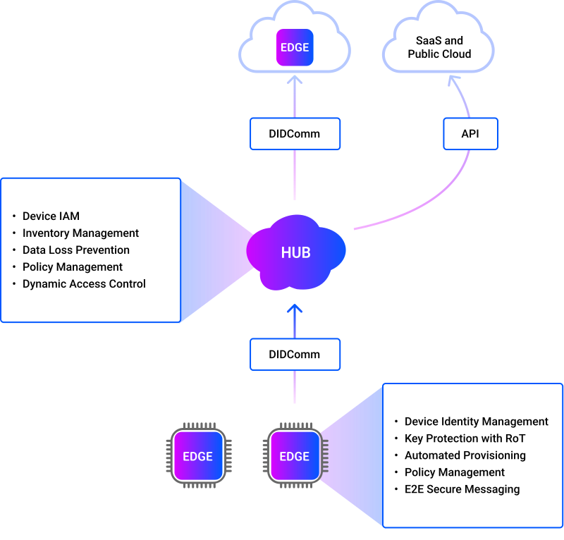

# What's UNiD?

UNiD is an open-source toolkit that enables any developers to connect all devices and clouds, using features of decentralized identifiers as a basis of security and privacy. At a high level, the core components in UNiD are as follows;

- **UNiD EDGE**: An open-source agent that integrates into devices.
- **UNiD HUB**: A cloud access security broker that acts as an intermediary between devices and clouds.
- **UNiD Network**: A distributed network that operates public key certificates (DID Documents) of EDGEs.

:::{figure-md}

**Figure 1.** The core components in UNiD
:::

As figure 1, you can launch your UNiD HUB and set up access policy, and integrate UNiD EDGE into your devices or clouds. You can easily build a security infrastructure that connects all your devices to the cloud with UNiD.

<!--
## Design Concept

Our main concept is to build a scalable, end-to-end security infrastructure that abstracts every device and the cloud as a global unique node, allowing a node to interact with other nodes securely and privately regardless of the network topology or routing hops.

:::{figure-md}

**Figure 2.** E2E security infrastructure
:::

To achieve this concept, we utilize decentralized identifiers (DIDs) and Root of Trust (RoT) technologies. Specifically, UNiD EDGE generates multiple key pairs from a hardware-derived true random number generator (TRNG) within the RoT secure processing environment, and generates a payload for registering with a blockchain-based decentralized PKI (DPKI) to create a DID document including the public key information. Anyone can obtain the corresponding device's public key from the network to authenticate the device and verify the digitally signed data. To learn more, click here.

This identity-first, end-to-end approach can abstract the complexity of security infrastructure and enables advanced, scalable endpoint security for connected systems. UNiD platform is designed to make the security infrastructure easily available and free all developers from the heavy burden of building the complex security infrastructure for each product.
-->

## Key Featrues

### UNiD EDGE

An open-source Rust library that is extensible into any type of devices. Currently supported OS is Linux Kernel x86 (32bit), Linux Kernel x86-64 (64 bit), and FreeRTOS. The core components are as follows;

- **Device Identity Management**: This component supports generating a global unique device identifier in compliance with a W3C Decentralized Identifiers Standard ([Decentralized Identifiers v1.0](https://www.w3.org/TR/did-core/)).
- **Key Management with RoT**: This component supports generating key pairs within the device and protect private keys with hardware security module, such as TPM2.0, TrustZone, Secure Crypto Engine.
- **Automated Provisioning**: This component supports registering and operating public key certificate (DID Document) generation, resolve, renewal, and revocation on a decentralized PKI without any IdPs, CAs, and intermediators.
- **Policy Management**: This component allows security-relevant configuration changes through an authorized UNiD HUB. It has access policy file (IPs, DIDs, endpoints), security policy file (security parameter, pre-shared-key) and update policy (logging transmission frequency).
- **E2E Secure Socket**: This component supports establishing a mutual authenticated channel with the HUB to exchange end-to-end authcrypt messages with clouds.
- **RoT Extension**: This component can be applied to RoTs with proprietary specifications by implementing shared libraries according to the API specification.
- **Device Extension**: This library can be distributed as middleware for IPC communication with client applications or as a library to be integrated into client application.

For more information, see <a href="https://github.com/getunid/unid" class="external" target="_blank" rel="noopener noreferrer">github page</a>.

<!--
:::{figure-md}

**Figure 3.** UNiD EDGE Architecture
:::
-->

### UNiD HUB

A cloud access security broker consists of access broker, access control engine, access policy, inventory for secure communications between all devices and clouds. The core components are as follows;

- **Device IAM**: This component supports device authentication based on digital signature scheme (256-bit ECDSA) rather than username and password.
- **Device Authenticity**: This component supports verifying the device authenticity by message authentication code generated by the pre-shared secret between EDGE and HUB.
- **Inventory Management**: This component supports managing a configuration file which stores authorized device DIDs and attributions.
- **Device Knowledge Database**: This component supports storing and real-time tracking device communication logs for vital checks and threat detection.
- **E2E Message Routing**: This component supports relaying encrypted messages on a publish/subscribe model between EDGEs.
- **Data Loss Prevention**: This component prevents devices from sending data or receiving data from unauthorized clouds by enforcing access policies.
- **Dynamic Access Control**: This component supports dynamically changing access policies based on device's identity, location, and behavior to prevent spoofing and unauthorized access
- **UNiD Studio**: User interface for operating the HUB supports launching a project and managing access policies and logging data of EDGEs.

<!--
:::{figure-md}

**Figure 4.** UNiD HUB Architecture
:::
-->

### UNiD Network

UNiD Network consists of a [sidetree protocol](https://identity.foundation/sidetree/spec/) for creating scalable DIDs networks that can run atop any existing decentralized anchoring system and be as open, public, and permissionless as the underlying anchoring systems they utilize. The protocol allows users to create globally unique identifiers and manage their associated PKI metadata, all without the need for centralized authorities or trusted third parties.

UNiD EDGE generates multiple key pairs from a hardware-derived true random number generator (TRNG) within the RoT secure processing environment, and generates a payload including public keys for registering with UNiD Network to create a DID document binding decentralized identifier and the public key. Anyone can obtain the corresponding device's public key from the distributed network to authenticate the device and verify the digitally signed data.