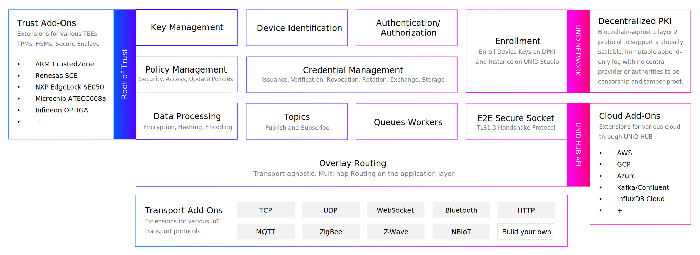

# UNiD EDGE (v1.0.0)

As shown in Figure 10, UNiD EDGE SDK consists of micro components and extensions that can support various hardware RoTs, transports and clouds. The components are written in Rust language and can be compiled into static libraries which can be handled in C language.
This section introduces the core features, API reference, and how to build the SDK on your device.

:::{figure-md}

**Figure 10.** UNiD EDGE SDK Architecture
:::

## UNiD EDGE Features

### DID as device identifier

The system software uses DID (Decentralized Identifier) as a device identifier based on the W3C DID Core 1.0 specification. In PSA-RoT secure storage, it generates multiple key pairs derived from TRNG, Physically Unique Function (PUF), and generates the payload by hashing the object containing this public key information. This payload can be registered with DPKI (Decentralized Public Key Infrastructure) to generate a DID document, which can be treated as a globally unique identifier independent of any third party. This DID is a URI that associates the device with a DID document that allows trustable interactions.

### Root of Trust (RoT)

The system software performs key generation and management in the RoT secure execution and storage area. Unauthorized applications and remote servers can not access the RoT secure area.
All sensitive information such as device key pairs, pre-configured security parameters, and device instances are encrypted and stored in RoT's secure storage. All data processing, including cryptography and digital signatures, is performed in RoT's secure execution area.

### Genuineness of device

Entities that communicate with the device can validate the authenticity of the device by verifying the digital signature. Specifically, the UNiD HUB will verify the authenticity of a device by verifying the device's digital signature and pre-defined client_secret in the handshake process. This mechanism makes it possible to detect and exclude unauthorized devices from the network, thus preventing virus intrusion and information leakage.

### End-to-end secure channel

Two-way communication (device-cloud, device- device) happens via a message handler, called by the customer, UNiD HUB. The system software stores the remote server’s DID and endpoint in RoT secure storage as a pre-configuration. Devices perform handshakes with the HUB to establish end-to-end secure connections with ECDH.
In the handshake process, the system sends the public key (for encryption) and encrypted and signed message including client_id and client_secret to the server as client hello. The server generates a common key with a received public key, and decrypts the message to verify the device's signature and client_secret, and responds with an encrypted and signed message to the device. The device then verifies the server’s signature and compares the server’s DID with the pre-configured DID to authenticate the server, and completes the handshake process.

### Access control

The system software stores in PSA-RoT secure storage a security policy regarding access privileges. Such a security policy is used by the system software to manage access privileges. Device security parameters can only be updated by privileged users who are allowed to access the UNiD HUB. There are two access privilege levels; Admin and User. Admin and User (including cloud application through API) are authenticated and authorized by HUB. Admin users are allowed to send encrypted and signed data with secret_token to the target device, and the device validates the secret_token using a pre-configured security policy to authenticate the admin user. In the system software, the execution of application functionalities is enabled with the lowest level of privilege necessary for the intended function.

### OTA Update

The system software supports updates from authorized remote servers. Integrity and authenticity are checked prior to execution and installation of the new image: The new firmware image (ECDSA signed) is downloaded from the authorized remote server. The decryption (AES-GCM) and signature verification (using the corresponding public key obtained from the remote server through a DID resolver) is then conducted in RoT secure storage. After validation of integrity and authenticity of the firmware image, the executable code can be stored in Slot1 of the bootloader (being Slot0 the active firmware) and flagged for update. At the next boot, the bootloader verifies the update and executes the update by swapping Slot0 and Slot1. The scope of the software system is to provide the validated executable code or the corresponding public key to the bootloader.
The device obtains the corresponding DID Document (including public key) from the DID resolver using the authorized remote server’s DID. The DID resolver receives the did_suffix (did:method:did_suffix) and gets the DID Document from the mongoDB of the DID resolver with did_suffix and returns it to the device. The data in mongoDB is a conflict-free replicated data type (CRDT) and the data integrity is ensured by the sidetree protocol which is a blockchain-agnostic 2nd layer protocol.

### Logging of security relevant events and errors

The logging data is buffered with EMERG/ALERT/CRIT/ERR/WARNING/NOTICE/DEBUG log level tags and FROM/TO/MESSAGE data format and will be sent to UNiD HUB. All logging data is digitally signed, encrypted (AES-GCM) in the RoT secure storage.
If the network of the device is temporarily interrupted, the logging data will be buffered with the maximum value of the pre-configured capacity, and the cached logging data will be sent to UNiD HUB when the network is reopened.
UNiD HUB verifies and decrypts the logging data and stores it in the server. Basically, the logging data is stored in the server for 2 years, but the storage period depends on the service plan users subscribe to. Users can access the logging data via UNiD HUB API. In the initial configuration, only the admin user can access the logging data. Admin users can change the access control of UNiD HUB. All the logging data can be searched by the logging tags.

### Security configuration

The system software allows users to change security parameters after authenticating privileged users according to predefined policies. Specifically, access policies (e.g., authorized entity’s DID and IP), security policy (e.g., configuration of cryptography), and update policies (e.g., HeartBeat frequency, logging transmission frequency, automatic installation of updated software) can be changed after user authentication.
Security-relevant configuration changes are allowed by the system software, just after authentication of privileged users (such authentication is in accordance to predefined policies). The security parameters that can be changed after user authentication include:

- Access policies (i.e. authorized entity’s DID and IP),
- Security policy (i.e. configuration of used cryptography), and
- Update policies (i.e. logging transmission frequency or automatic installation of updated software)

### Dependent Cryptography

The system software uses the best practice cryptography in the NIST recommended cipher lists.

- ECC secp256k1 curve (is an elliptic curve of Koblitz type and a security level of 256 bit)
- ECDSA 256 bit for signature algorithm
- ECDH 256 bit for key exchange
- AES 256bit GCM in compliant with NIST FIPS PUB 197 for encryption
- PBKDF2 in compliant with NIST SP 800-132 for key derivation
- SHA-256, 512 in compliant with NIST FIPS PUB 180-4 for hashing
- HMAC in compliant with NIST FIPS PUB 198-1 for message authentication code
